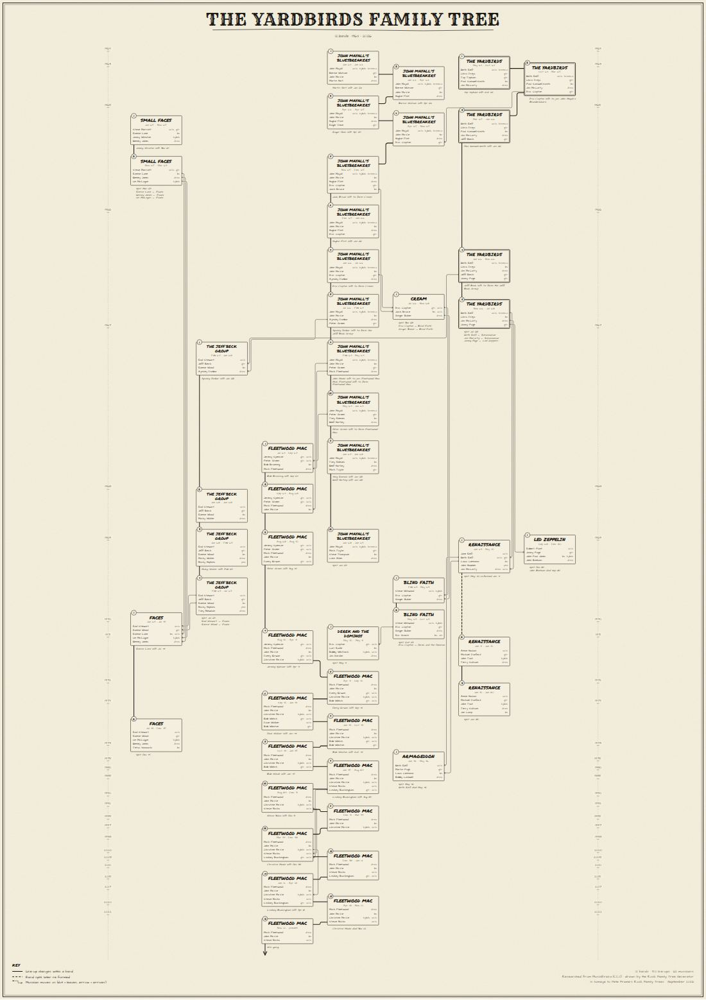
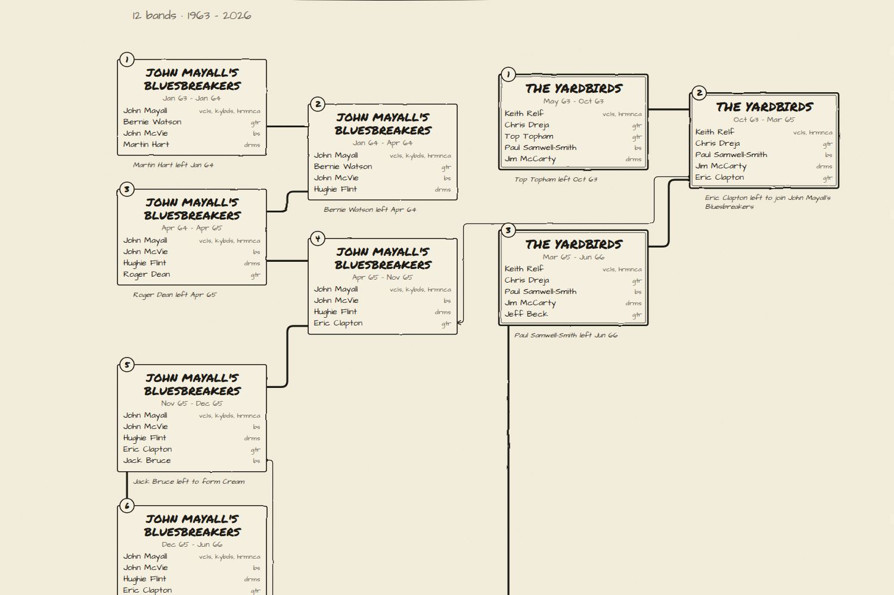

# Rock Family Tree Generator (RFTG)

Generate printable "Rock Family Tree" posters in the style of Pete Frame's hand-drawn classics: every line-up of every band as a numbered box, time running down the page, thick lines joining a band's line-ups, and thin lines following each musician as they leave to form or join the next band. Handwritten-style notes say who left, who died and when bands split.

| Whole poster (offline demo) | Detail |
| --- | --- |
|  |  |

Data comes from [MusicBrainz](https://musicbrainz.org) ("member of band" relationships and their dates).

## Getting started

### Everything in Docker

```bash
docker compose up --build
```

* App: http://localhost:3000
* API: http://localhost:8000 (docs at `/docs`)
* Neo4j browser: http://localhost:7474 · RabbitMQ: http://localhost:15672

Settings have sensible defaults; copy `sample.env` to `.env` to change them (at least set `MB_USER_AGENT` to include your contact details, which MusicBrainz asks for, and change `NEO4J_PASSWORD`).

### Without any infrastructure

No RabbitMQ or Neo4j needed: jobs run inside the API process and MusicBrainz responses are cached as JSON files.

```bash
cd backend && pip install -r requirements.txt && uvicorn main:app --port 8000
cd frontend && npm install && npm run dev        # http://localhost:3000
```

### Offline demo

Search for "yardbirds" (or click *Try the offline demo*) to draw the Yardbirds family — Cream, Led Zeppelin, Fleetwood Mac, Faces and more — from built-in data. It needs no network access. The dates are approximate.

## How it works

```
search ─► harvester ─► refiner ─► cartographer ─► artist ─► SVG
          (MusicBrainz   (line-ups,   (Frame-style    (hand-lettered,
           + cache)       notes)       layout)         self-contained)
```

| Module | Job |
| --- | --- |
| `app/musicbrainz.py` | JSON web-service client (rate limited to 1 req/s, retries) that normalises artists into cacheable records |
| `app/store.py`, `app/graph_db.py` | Record cache: Neo4j when configured and reachable, otherwise JSON files |
| `app/harvester.py` | Follows band → members → their other bands for *depth* generations, within a fetch budget |
| `app/refiner.py` | Parses dates, splits each band's history into numbered line-ups, abbreviates instruments Frame-style (vcls, gtr, bs, drms, kybds…), picks the most connected bands |
| `app/cartographer.py` | Layout: time-proportional rows, lanes that put related bands side by side and are reused when bands end, zig-zagging for long-running bands, line routing through the gutters, notes, year scale, paper sizing (A0–A4) |
| `app/artist.py` | Renders the SVG with embedded fonts, so the file looks the same everywhere and prints at any size |
| `app/jobs.py`, `app/worker.py` | Job progress (shared JSON files) and the Celery task |

### Options (`POST /generate`)

| Field | Default | Meaning |
| --- | --- | --- |
| `artist_id` | — | MusicBrainz ID of a band or musician (or `demo:yardbirds`) |
| `depth` | 2 | 1 = just the band, 2 = plus members' other bands, 3–4 = further out |
| `max_bands` | 24 | Cap on bands drawn; the most connected are kept |
| `title`, `subtitle` | auto | Poster heading |
| `paper` | `A1` | `A0`–`A4` (portrait or landscape chosen automatically) or `none` |
| `hand_drawn` | true | Slight ink wobble on lines and boxes |
| `coloured_lines` | false | Give each musician's lines their own colour |
| `refresh` | false | Ignore the cache and re-fetch from MusicBrainz |

Other endpoints: `GET /search?q=`, `GET /samples`, `GET /status/{job_id}`, `GET /download/{job_id}` (SVG), `GET /tree/{job_id}` (the tree data as JSON). Everything is also served under `/api/…`.

## Development

```bash
cd backend
pip install -r requirements-dev.txt
pytest                                   # unit, layout and API tests (no network needed)
python tests/live_smoke.py               # against a running stack with MusicBrainz access
```

Bundled fonts (Architects Daughter, Permanent Marker, Rye) are open-licensed; see `backend/app/assets/fonts/LICENSE.txt`.

This project is a homage: *Rock Family Trees* are the work of Pete Frame.
